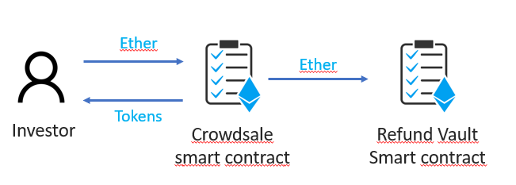
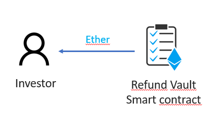
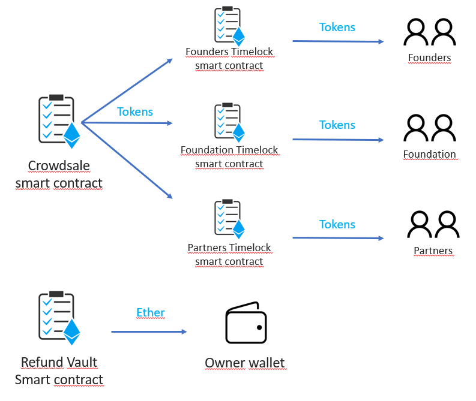
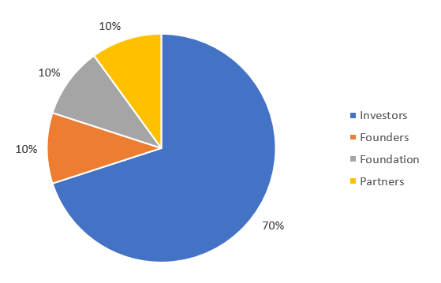

`#Ethereum`

# Initial Coin Offering

This is an Initial Coin Offering (ICO) built with smart contracts powered by Ethereum. It basically consists in a set of smart contracts to raise funds from different investors, providing them a new ERC-20 token.

## Table of Contents

- [Getting Started](#getting-started)
- [The Project](#the-project)
- [Resources](#resources)

## Getting Started

These instructions will get you a copy of the project up and running on your
local machine for development and testing purposes.

### The repository

First, you will need to `clone` or `fork` the repository into your Github
account:


```
$ git clone https://github.com/miquelTC/initial-coin-offering.git
```

### Installing

First, you will need to install the dependencies with: `npm install`.

Run the following command in your terminal after cloning the main repo:

```
$ npm install
```

Then, you will need to install Truffle globally by running the following command int your terminal:

```
$ npm install -g truffle
```

### Running the Tests

First, you will have to compile the smart contracts by running the following command in your terminal:

```
$ truffle compile
```

Then you will have to install and run Ganache to run your blockchain locally:

https://www.trufflesuite.com/ganache

Then, the tests that validate your solution can be executed by runing the following
command:

```
$ truffle test
```

### Deployment

In order to deploy your smart contract, you must create your .env file and specify:

- `MNEMONIC` --> chose a set of words which will be the seed of your wallet
- `INFURA_API_KEY` --> API key provided by Infura: https://infura.io

Then, you will need to run the following command (let's use the testnet Ropsten in this example):

```
$ truffle migrate --network ropsten
```

### Technologies used

- `Solidity`
- `JavaScript`
- `Truffle`
- `Web3.js`
- `Ganache`
- `Node.js`

## The Project

This project consists in a set of smart contracts powered by Ethereum, which purpose is to raise funds from different investors, providing them ERC-20 tokens in exchange. This way of raising funds via tokens is called ICO (initial coin offering).

There are some aspects to consider:
- This is a minted crowdsale, which means that Tokens are created (minted) as soon as the investor sends Ether
- This is a capped crowdsale, which means that there is a maximum amount of funds (Ether) to be raised
- This is a timed crowdsale, which means that there is a specific duration for each phase of this ICO
- This is a whitelisted crowdsale, which means that investors must be added to the list if they want to participate
- This is a refundable crowdsale, which means that if the raised amount is not achieving a specific goal, investors can claim their Ether back
- Tokens are paused until the crowdsale is over, meaning that investors cannot transfer or sell Tokens until the crowdsale is over

We can distinguish between 3 different phases: pre-ICO, ICO and post-ICO:

### Pre-ICO phase


During the pre-ICO phase, investors can buy Tokens at a better rate than later on. The mechanism to buy consists in the investor sending Ether to the Crowdsale smart contract. Then, the investor will receive the Tokens (minted by the Crowdsale), and the Crowdsale smart contract will send the Ether to the owner's wallet. 
These Ethers cannot be refunded.

### ICO phase



During the ICO phase, investors can buy Tokens using the same mechanism as in previous phase, but there are two main differences:
- Ethers invested can be refunded if the Crowdsale is not raising enough funds, so not achieving the defined goal
- The rate is not as good as in the pre-ICO phase, meaning that the investor will receive less amount of Tokens with the same amount of Ether invested

As you can see in the image above, Ether is sent to the Refund Vault smart contract, and depending on if the goal is achieved or not, the funds will be sent to the owner's wallet or back to those investors who claim their funds.

### Post-ICO phase

Once the ICO is over after a certain amount of time (defined by deployer), there are 2 possible scenarios:
- The goal is not achieved
- The goal is achieved

#### Goal not achieved



In this case, investors can claim their funds to the Refund Vault smart contract, and they will receive their invested Ether back.

#### Goal achieved



If the goal is acheived, first of all, the Ether is sent from the Refund Vault smart contract to the owner's wallet.
This means investors cannot claim their funds back anymore.

Secondly the Tokens are unpaused, meaning they can already by transferred.

Finally, the Crowdsale smart contract is deploying three different smart contracts (one for foudners, one for the foundation and one for partners).
The purpose of these Timelock smart contracts is to send Tokens there and lock them until the vesting period is over.
Only when the vesting period is over, these tokens can be claimed to be sent to the founders, foudnation and partners wallets.
This is a mechanism to keep the tokenomics of the Token under control.

The amount of Tokens sent will depend on the amount of Tokens purchased by all investors, and it will follow this distribution:



## Resources

- [ethereum.org](https://ethereum.org/)
- [truffle suit](https://www.trufflesuite.com/)
- [node.js](https://nodejs.org/)
- [web3.js](https://web3js.readthedocs.io/)
