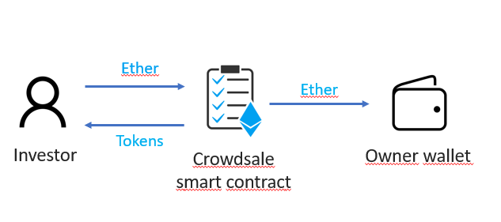

`#Ethereum`

<!-- ALL-CONTRIBUTORS-BADGE:START - Do not remove or modify this section -->

[](#contributors-)

<!-- ALL-CONTRIBUTORS-BADGE:END -->

# Initial Coin Offering

This is an Initial Coin Offering (ICO) built with smart contracts powered by Ethereum. It basically consists in a set of smart contracts to raise funds from different investors, providing them a new ERC-20 token.

## Table of Contents

- [Getting Started](#getting-started)
- [The Project](#the-project)
- [Project requirements](#project-requirements)
- [Resources](#resources)

## Getting Started

These instructions will get you a copy of the project up and running on your
local machine for development and testing purposes.

See deployment for notes on how to deploy the project on a live system.

### The repository

First, you will need to `clone` or `fork` the repository into your Github
account:


```
$ git clone https://github.com/miquelTC/initial-coin-offering.git
```

### Installing

First, you will need to install the dependencies with: `npm install`.

Run the following command in your terminal after cloning the main repo:

```
$ npm install
```

Secondly, you will need to install Truffle globally by running the following command int your terminal:

```
$ npm install -g truffle
```

### Running the Tests

First, you will have to compile the smart contracts by running the following command in your terminal:

```
$ truffle compile
```

Then you will have to install and run Ganache to run your blockchain locally:

https://www.trufflesuite.com/ganache

Then, the tests that validate your solution can be executed by runing the following
command:

```
$ truffle test
```

### Deployment

In order to deploy your smart contract, you must create your .env file and specify:

- `MNEMONIC` --> chose a set of words which will be the seed of your wallet
- `INFURA_API_KEY` --> API key provided by Infura: https://infura.io

Then, you will need to run the following command (let's use the testnet Ropsten in this example):

```
$ truffle migrate --network ropsten
```

### Technologies used

- `Solidity`
- `JavaScript`
- `Truffle`
- `Web3.js`
- `Ganache`
- `Node.js`

## The Project

This project consists in a set of smart contracts powered by Ethereum, which purpose is to raise funds from different investors, providing them ERC-20 tokens in exchange. This way of raising funds via tokens is called ICO (initial coin offering).

There are some aspects to take into account:
- This is a minted crowdsale, which means that Tokens are created (minted) as soon as the investor sends Ether
- This is a capped crowdsale, which means that there is a maximum amount of funds (Ether) to be raised
- This is a timed crowdsale, which means that there is a specific duration for each phase of this ICO
- This is a whitelisted crowdsale, which means that investors must be added to the list if they want to participate
- This is a refundable crowdsale, which means that if the raised amount is not achieving a specific goal, investors can claim their Ether back

We can distinguish between 3 different phases: pre-ICO, ICO and post-ICO:

### Pre-ICO




## Project requirements


## Resources

- [ethereum.org](https://ethereum.org/)
- [truffle suit](https://www.trufflesuite.com/)
- [node.js](https://nodejs.org/)
- [web3.js](https://web3js.readthedocs.io/)
